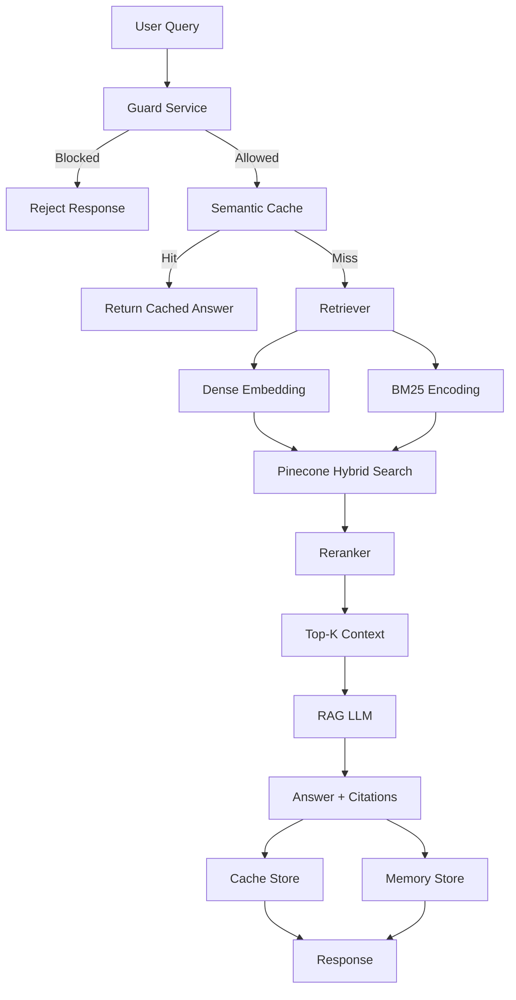
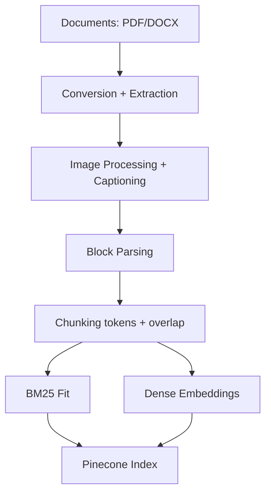

# RAG-Based Knowledge Retrieval System

A modular Retrieval-Augmented Generation (RAG) system built with FastAPI, combining hybrid retrieval (dense + sparse), reranking, guardrails, caching, and session-based memory.

---

## Overview

This project implements a full RAG pipeline:

* Document ingestion → chunking → indexing
* Hybrid retrieval (dense + BM25)
* Reranking for relevance
* LLM-based answer generation constrained to retrieved context
* Guardrails for unsafe or adversarial queries
* Semantic caching and session memory

The focus is on **retrieval quality and evaluation**, not on UI or deployment infrastructure.

---

## Scope

What this system does:

* Retrieves and ranks relevant context from a document corpus
* Generates answers grounded in retrieved content
* Tracks conversation history per session
* Evaluates answer quality using LLM-based scoring

What it does not aim to solve:

* End-to-end production deployment
* Real-time streaming responses
* Highly optimized ingestion for large-scale datasets
* Perfect handling of all PDF layouts

---

## Models Used

**Embeddings**

* `nomic-ai/nomic-embed-text-v1.5`

**Sparse Retrieval**

* BM25 (fit on corpus)

**Reranker**

* `cross-encoder/ms-marco-MiniLM-L-12-v2`

**LLM (via Groq)**

* `llama-3.1-8b-instant`

Used for:

* Answer generation
* Guard classification
* Evaluation (LLM-as-judge)
* Conversation summarization

**Image Captioning**

* `meta-llama/llama-4-scout-17b-16e-instruct`

---

## System Flow

```
User Query
  → Guard Check
  → Cache Lookup
  → Retrieval (Dense + BM25)
  → Reranking
  → Context Selection
  → LLM Generation
  → Response + Citations
  → Cache + Memory Write
```

---

## Setup

```bash
git clone <repo>
cd <repo>
pip install -r requirements.txt
```

Create `.env`:

```
PINECONE_API_KEY=
PINECONE_INDEX=
GROQ_API_KEY=
REDIS_URL=
SUPABASE_URL=
SUPABASE_KEY=
JWT_SECRET_KEY=
```

---

## Run

```bash
uvicorn app.main:app --reload
```

---

## API

### Generate Token

```
POST /token
```

### Ask

```
POST /ask
```

Request:

```json
{
  "query": "...",
  "session_id": "...",
  "force_refresh": false
}
```

---

## Ingestion

Trigger:

```
POST /ingest_folder
```

Pipeline:

* DOCX → PDF conversion
* PDF → markdown extraction (PyMuPDF)
* Image extraction + captioning
* Block parsing (headings, tables, paragraphs)
* Token-based chunking with overlap
* BM25 fitting (full corpus)
* Pinecone indexing
  


---

## Testing

Run with configurable inputs:

```bash
export TEST_FILE="<path>"
export REPORT_FILE="<output>"
pytest
```

Evaluation metrics:

* Faithfulness
* Factual accuracy
* Relevance
* Completeness
* Groundedness


The repository includes evaluation queries for synthetic/sample documents only.

Additional internal evaluation queries were used during testing but are not included in the public repository because they reference third-party documents.

---
## Dataset

The system was evaluated using a small curated corpus: 

- 2 publicly available technical PDFs and 3 synthetic AI-generated documents used for testing ingestion and retrieval behavior.

---

## Known Limitations

* BM25 requires full re-fit when corpus changes
* Ingestion is not optimized for large-scale datasets
* Limited handling of complex PDF layouts

---

## Future Work

* Incremental indexing
* Faster / batched image processing
* Improved fallback handling
* Broader evaluation coverage

